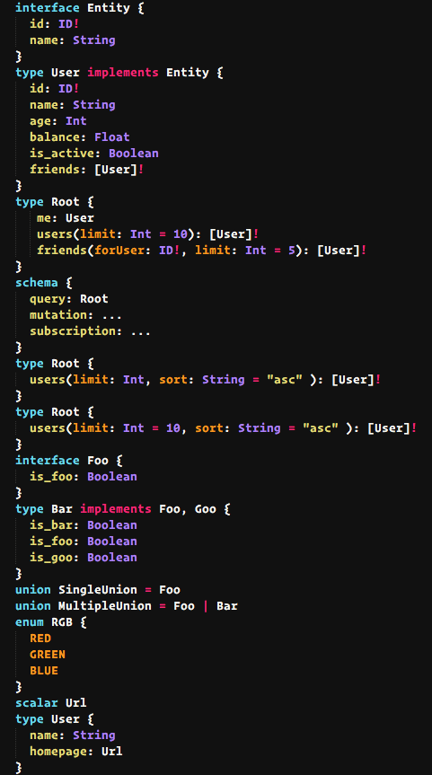

# GraphQL Language Definition for SublimeText 2+

**Though this package _could_ be installed in [currently] any version of Sublime, this version supports SublimeText<3092.
[The newer package supports 3092+](https://github.com/dncrews/GraphQL-SublimeText)**

GraphQL language definition for SublimeText. Finally support syntax highlighting for your GraphQL IDL files!

## Installation and Use

1. [Install Package Control](https://sublime.wbond.net/installation)
2. `Package Control: Install Package` => `GraphQL`

## Contributing

This is still super young. I'd appreciate any contribution. [PLEASE HELP](https://www.youtube.com/watch?v=1eSMxRya2S8)
